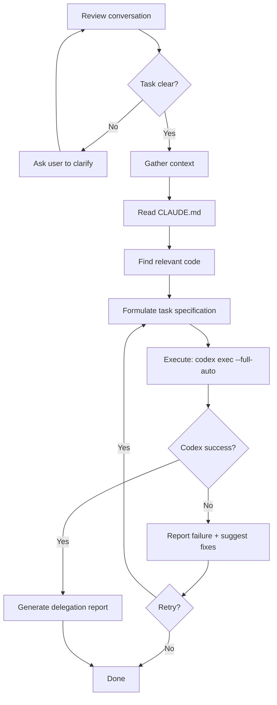

# Codex Delegate

Delegate coding tasks to headless Codex agent for autonomous implementation.

## Workflow



## Quick Reference

| Phase | Action |
|-------|--------|
| **Identify** | Extract task, scope, success criteria from conversation |
| **Gather** | Read CLAUDE.md, find relevant code patterns |
| **Formulate** | Write spec with context + requirements + success criteria |
| **Execute** | `codex exec --full-auto "PROMPT"` |
| **Report** | Task, context, changes, verification, follow-up |

## Task Specification Template

```text
# Project Context
[Paste CLAUDE.md sections directly]

# Task
[Clear description from conversation]

# Relevant Files
[List key files]

# Requirements
- [requirement 1]
- [requirement 2]

# Success Criteria
- [measurable outcomes]
```

**DO:** Inject CLAUDE.md context directly, be specific about requirements, state clear success criteria
**DON'T:** Tell Codex how to implement, over-constrain the solution

## Delegation Report Template

```markdown
### Task Identified
[from context]

### Context Provided
[CLAUDE.md sections included]

### What Codex Did
- Files: [created/modified]
- Summary: [changes made]

### Verification
- [x] Meets success criteria
- [ ] Issues encountered

### Files Changed
- [file]: [description]

### Follow-up
- [ ] [remaining tasks]
- [ ] [review items]
```

## Important

- **Context injection:** Paste CLAUDE.md directly into prompt (no separate AGENTS.md)
- **Iterate:** Re-run with refined prompts if Codex fails
- **Report:** Always include verification status in report

## Command

```bash
codex exec --full-auto "TASK_SPEC" 2>&1
```

`--full-auto` enables workspace-write sandbox + on-request approval mode.
